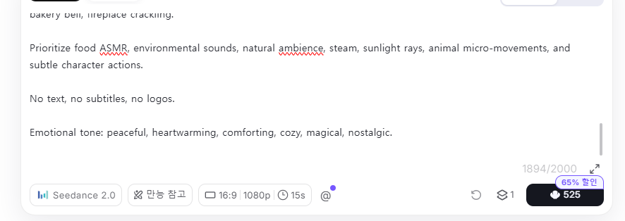

# ChatGPT + Seedance로 지브리 감성 애니메이션 만들기

"숲속 작은 빵집의 아침" 영상 제작 방법

---

## 결과물

아래와 같은 지브리 감성의 애니메이션 영상을 만들 수 있습니다.

- 숲속 작은 빵집
- 할머니 제빵사
- 동물 친구들
- 따뜻한 아침 분위기
- ASMR 중심 영상

특별한 영상 편집 기술 없이도 제작 가능합니다.

---

# STEP 1

## ChatGPT에서 스토리보드 만들기

먼저 만들고 싶은 영상 주제를 정합니다.

예시

- 숲속 작은 빵집
- 마녀의 수프 가게
- 고양이 식당
- 할머니의 정원
- 비 오는 날의 서점

ChatGPT에 아래와 같이 입력합니다.

### 프롬프트

"숲속 작은 빵집의 아침을 주제로

1980년대 지브리 애니메이션 느낌의

16:9 비율 4x4 스토리보드를 만들어줘.

주인공은 할머니 제빵사.

새벽에 일어나 빵을 만들고

동물 친구들이 찾아오는 이야기.

따뜻하고 감성적인 분위기.

텍스트 없이 생성."

---

# STEP 2

## 스토리보드 이미지 생성

생성된 스토리보드를 이미지로 만듭니다.

팁

✔ 16:9 비율

✔ 4x4 구성

✔ 장면별 일관성 유지

✔ 주인공 동일하게 유지

✔ 빛의 방향 통일

---

# STEP 3

## Seedance 2.0 실행
여러 사이트가 있는데, 저는 Hailuo에서 작업했어요.

[https://hailuoai.video/](https://hailuoai.video/)

모드: Seedance 2.0

만능참고 기능 

---

# STEP 4

## 스토리보드 업로드

생성한 스토리보드 이미지를 업로드합니다.

설정값

- 재생시간 : 15초
- 비율 : 16:9
- 만능참고 ON

---

# STEP 5

## 영상 프롬프트 입력

예시 프롬프트

Transform this storyboard into a seamless cinematic animated short film.

A cozy forest bakery on a peaceful morning.

An elderly grandmother baker slices freshly baked bread. Steam rises from the bread. She carefully wraps bread in paper bags and hands them to forest animals.

Rabbits, squirrels, birds, deer and other animals gather around the bakery. Villagers slowly arrive as golden morning sunlight fills the bakery.

Final shot reveals the bakery surrounded by flowers, animals and warm forest light.

1980s hand-painted Japanese animation style, warm watercolor textures, nostalgic atmosphere, cinematic storytelling.

No music. No dialogue.

ASMR sounds only:

bread slicing, steam, paper bag rustling, bird sounds, forest wind, fireplace crackling.

No text, no subtitles.

---

# STEP 6

## 편집하기

CapCut 으로 마무리합니다.

추가하면 좋은 것

- 자연 환경음
- 새소리
- 바람소리
- 빵 ASMR

오히려 음악 없이 만드는 것이 더 감성적일 수 있습니다.

---

# 활용 아이디어

🍞 숲속 작은 빵집

🧙 마녀의 수프 가게

🐱 고양이 식당

☕ 숲속 카페

📚 비 오는 날의 서점

🌲 숲속 우체국

🦊 여우 베이커리

🐻 곰 아저씨의 수프 가게

---

## 핵심 공식

좋은 영상 =

좋은 스토리

→ 좋은 스토리보드

→ 좋은 영상 프롬프트

AI는 영상을 만들어주지만,

이야기는 결국 사람이 만듭니다. ✨