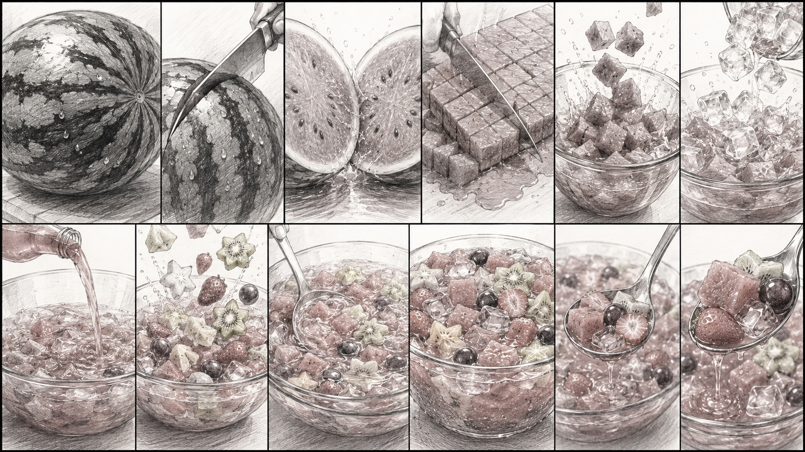

# ChatGPT 스토리 보드로 ASMR 영상 만들기

# 1. 스토리 보드 만들기 (ChatGPT로 생성)

<aside>

Prompt: 수박화채 12컷 스토리보드 이미지 생성 프롬프트 21:9 초광각 가로 캔버스 안에, 15초 애니메이션 요리 영상용 수박화채의 상세한 12컷 스토리보드를 한 장의 이미지로 구성한다. 스타일은 영화 제작 현장에서 사용하는 전문 스토리보드 같은 연필 스케치 스타일이다. 손으로 그린 듯한 러프한 느낌은 있지만 구도는 명확하며, 요리 과정과 움직임, 시선 흐름이 한눈에 이해되어야 한다. 각 컷은 독립적인 하나의 장면으로 구성하며, 한 컷에 여러 액션을 넣지 않는다. 문자, 자막, 설명문, 효과음 글자, 숫자, 화살표는 절대 넣지 않는다. 오직 그림만으로 스토리가 전달되어야 한다. 전체 목표는 다음과 같다. 보기만 해도 시원하고 달콤해 보이는 여름 간식 수박 자르는 소리, 얼음 떨어지는 소리, 음료 붓는 소리가 머릿속에서 재생되는 ASMR 느낌 여름 더위를 잊게 만드는 청량감 SNS에서 바이럴될 만큼 강한 시각적 매력 마지막 컷으로 갈수록 먹고 싶어지는 몰입감 완성 요리는 참고 이미지처럼 커다란 빈티지 유리 양푼 볼에 담긴 수박화채이다. 유리볼 안에는 잘 익은 수박 딸기 청포도 적포도 별 모양 키위 별 모양 멜론 얼음 분홍빛 달콤한 음료 가 가득 담겨 있다. 레이아웃은 상단 6컷 하단 6컷 총 12컷 카메라는 극근접, 근접, 탑뷰를 중심으로 구성한다. 전체적으로 음식 광고 프리비즈(Previs) 수준의 전문적인 스토리보드 완성도를 가진다. 1컷 커다랗고 둥근 수박이 도마 위에 놓여 있다. 극근접 샷. 짙은 초록 줄무늬가 선명하고 윤기가 흐른다. 묵직하고 잘 익은 수박의 존재감이 느껴진다. 2컷 큰 칼이 수박 중앙으로 들어간다. 칼날이 껍질을 가르기 시작하는 순간. 긴장감 있는 장면. 3컷 수박이 반으로 갈라진다. 붉은 과육이 드러나고 수분이 반짝인다. 가장 시원하고 만족스러운 순간. 4컷 수박 과육을 정사각형으로 자른다. 리듬감 있는 칼질. 수박즙이 살짝 번지는 모습. 5컷 잘린 수박 조각들이 커다란 유리 양푼 볼 안으로 떨어진다. 통통 튀는 움직임. 수박즙이 살짝 튄다. 6컷 얼음이 유리볼 안으로 떨어진다. 투명한 얼음들이 수박 위로 굴러간다. 차가운 여름 분위기. 7컷 분홍빛 달콤한 음료를 붓는다. 음료가 수박 사이를 흐르며 채워진다. 아름다운 물결과 흐름. 8컷 별 모양 키위, 별 모양 멜론, 딸기, 포도 등을 넣는다. 과일들이 화려하게 흩어지며 올라간다. 색감이 풍성해진다. 9컷 긴 숟가락으로 화채를 살살 섞는다. 수박, 과일, 얼음, 음료가 함께 움직인다. 시원한 물결이 퍼진다. 10컷 완성된 수박화채 클로즈업. 참고 이미지처럼 분홍빛 유리 양푼 볼. 과일과 얼음이 가득 담겨 있다. 김 대신 차가운 물방울이 맺혀 있다. 11컷 숟가락으로 수박화채를 한가득 떠올린다. 수박, 포도, 딸기, 음료가 함께 담긴다. 음료가 다시 볼 안으로 떨어진다. 12컷 최고의 하이라이트 장면. 숟가락 가득 담긴 수박화채를 카메라 앞으로 들어 올린다. 붉은 수박. 반짝이는 과일. 차가운 얼음. 달콤한 분홍빛 음료. 유리볼 속 과일들이 반짝인다. 보는 사람이 당장 한 숟갈 먹고 싶어지는 강렬한 마무리 컷. 비주얼 연출 연필선으로 물방울, 시원함, 움직임 표현 유리볼의 투명함 강조 수박의 수분감 표현 얼음의 차가움 표현 음식 광고 수준의 구도 사실적인 손과 조리도구 보기만 해도 "툭", "사각", "찰랑", "톡" 소리가 들리는 ASMR 느낌 마지막 컷으로 갈수록 청량감과 식욕 상승 고급 음식 광고용 전문 스토리보드 네거티브 프롬프트 문자, 자막, 설명문, 효과음 글자, 숫자, 화살표, 말풍선, 여러 액션이 섞인 컷, 부자연스러운 손, 잘못된 칼질, 왜곡된 원근감, 맛없어 보이는 과일, 흐릿한 수박, 과도한 배경 장식, 전신 인물, 과도한 소품, 만화 스타일, 컬러 일러스트 스타일, 완성된 회화 스타일, 읽기 어려운 구도, 어수선한 레이아웃, 저품질 음식 표현.

</aside>

# 2. Seedance 2.0 으로 15초 영상 만들기.

[https://hailuoai.video/](https://hailuoai.video/)

<설정>

<aside>

Prompt:  Generate a 15-second high-quality anime-style ASMR cooking video of Korean Watermelon Punch (Subak Hwachae).

16:9 aspect ratio.

Bright summer kitchen with warm natural sunlight.

A large ripe watermelon, wooden cutting board, transparent vintage glass bowl, crystal-clear ice cubes, strawberries, green grapes, red grapes, star-shaped kiwi slices, star-shaped melon slices, and a sweet pink fruit drink.

Sequence:

Cut a large watermelon in half.

Dice the juicy red watermelon into cubes.

Drop the cubes into a large transparent glass bowl.

Add ice cubes.

Pour a sparkling sweet pink fruit drink.

Add strawberries, grapes, kiwi stars, and melon stars.

Gently stir with a spoon.

Close-up of the completed watermelon punch.

Scoop up a spoonful filled with watermelon, fruit, ice, and pink drink.

Final hero shot with dripping juice and sparkling fruit.

Style:

High-quality Japanese food animation.

Realistic textures.

Juicy watermelon.

Refreshing summer atmosphere.

Beautiful transparent glass bowl.

Cold condensation droplets.

Food commercial quality.

No text.

No subtitles.

No logo.

No narration.

No music.

Only satisfying ASMR sounds:

watermelon cutting, ice clinking, liquid pouring, fruit dropping, spoon stirring, gentle splashing.

Refreshing, appetizing, cinematic, highly detailed.

</aside>